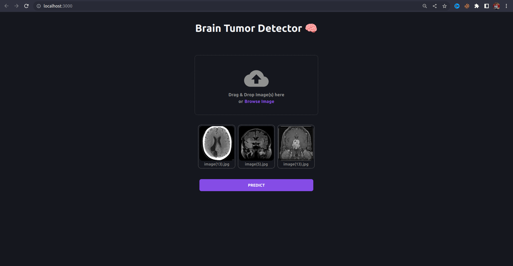
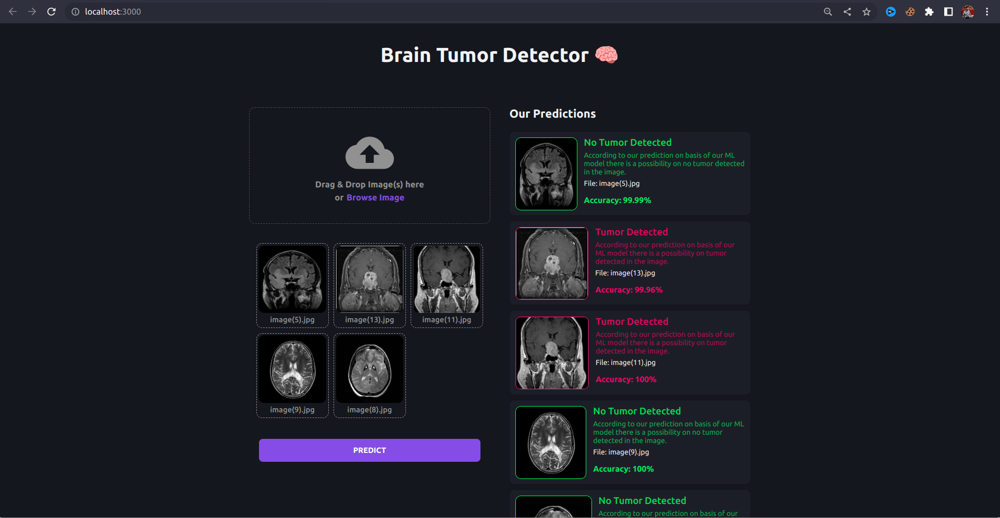

# Brain-Tumor-Detection
Brain tumor detection and prediction using keras vgg-16

## Demo
  <b>Link:<b/> https://brain-tumor.netlify.app/
  <p>
  
  

https://user-images.githubusercontent.com/64485885/228761355-885f5953-c953-4ae4-bbae-b3f1171f2801.mp4
</p>


## Get Started

Create a new enviornment
```
conda create -p venv python==3.10.6 -y
```

Activate the enviornment

```
conda activate venv/
```

Install the requirements

```
pip install -r requirements.txt
```

## Start the server

Open a new terminal and type

```
gunicorn app:app
```

## Start the web app

Open a new terminal

```
cd client
```

Install the dependencies
```
npm install
```

Start the react app
```
npm start
```
And you are good to go!


# About the project

```
Problem Statement:

The detection of brain tumors is a critical task in the field of medical imaging, as it can significantly impact patient outcomes. However, accurately detecting brain tumors can be challenging due to the complex nature of the human brain and the variability in the appearance of tumors. Therefore, there is a need for an automated and accurate brain tumor detection system that can assist healthcare professionals in diagnosing brain tumors.

The goal of this project is to develop a brain tumor detection system that can accurately classify brain scans as either containing a tumor or not. We aim to create a model that can handle the variability in brain scans and provide accurate results in a timely manner. Additionally, we aim to develop a user-friendly interface that can make our model accessible to healthcare professionals and patients alike.

To achieve our goal, we will use a dataset consisting of brain scan images with and without tumors. We will preprocess and augment the dataset to increase its size and variability. We will then use a pre-trained VGG16 model to train the data and generate predictions for new images.

Finally, we will create a web-based interface using React and Flask that allows users to upload and analyze brain scans using our model. By providing a user-friendly and accessible brain tumor detection system, we aim to improve the accuracy and speed of brain tumor diagnosis, ultimately leading to better patient outcomes.

```

## Machine learnng model

In this project, we aimed to develop a model that can accurately classify brain scans as either having a tumor or not. To achieve this, we used a dataset consisting of images of brain scans with and without tumors. However, since the dataset was relatively small, we augmented the data to increase its size and diversity.

Data augmentation involves generating additional images from the existing ones by applying various transformations such as rotation, flipping, scaling, and shifting. By doing so, we can create more samples that are similar to the original ones but have slightly different features, thereby increasing the variability in the data and making the model more robust.

After augmenting the data, we trained a VGG16 model on the dataset. The VGG16 is a deep convolutional neural network that is widely used for image classification tasks. The model consists of multiple convolutional and pooling layers followed by several fully connected layers. It can extract features from the input images and use them to classify the images into different categories.

During training, we used the augmented dataset to train the model using backpropagation, which involves adjusting the weights of the model based on the difference between the predicted and actual labels. We also used techniques such as dropout and regularization to prevent overfitting and improve the generalization of the model.

After training, we evaluated the performance of the model on a separate test set. We obtained an accuracy of 99% on the test set, which indicates that the model is able to accurately classify brain scans as either having a tumor or not.

In summary, by augmenting the dataset and training a VGG16 model, we were able to develop a highly accurate brain tumor detection system. This system has the potential to aid healthcare professionals in diagnosing brain tumors more quickly and accurately, which can ultimately improve patient outcomes.

Finally saved the model using pickle

### About VGG16 Model

The VGG16 model is a deep convolutional neural network that is widely used for image classification tasks. In the context of brain tumor detection, the VGG16 model can be trained to classify brain scans as either benign or malignant. Here is a brief description of how the VGG16 model works:

Input: The model takes in a brain scan as input. The input is typically a 3D array of pixel values representing the image.

Convolutional Layers: The input is passed through a series of convolutional layers, each of which extracts increasingly complex features from the input image. The convolutional layers use filters to scan the image and identify patterns and structures.

Pooling Layers: After each convolutional layer, the model uses pooling layers to reduce the spatial dimensions of the features while retaining their important information. This reduces the number of parameters in the model and helps prevent overfitting.

Flatten: Once the features have been extracted, the model flattens them into a 1D vector.

Fully Connected Layers: The flattened features are then passed through a series of fully connected layers. These layers perform the final classification of the input image into one of the two categories (benign or malignant). The final layer uses a softmax activation function to produce a probability distribution over the two classes.

Output: The output of the model is the probability of the input image belonging to each of the two classes. The class with the highest probability is the predicted class for the input image.

To train the model, a dataset of brain scans with known labels (benign or malignant) is used. The VGG16 model is trained using backpropagation to adjust the weights of the model to minimize the error between the predicted and actual labels. Once the model is trained, it can be used to classify new brain scans as either benign or malignant.

## Created Backend Rest API

To make our brain tumor detection model accessible to users, we created a REST API using Flask and FastAPI. The API provides an endpoint that accepts an input image and returns a prediction of whether the image contains a tumor or not.

To create the API, we first loaded the pre-trained VGG16 model into memory using pickle. We then used Flask and FastAPI to create a web application that exposes an HTTP endpoint for users to interact with. When a user sends a request to the endpoint with an input image, the server uses the loaded model to generate a prediction for the image.

To process the input image, we used the Python Imaging Library (PIL) to load the image into memory and convert it to a format that the model can handle. We then passed the image through the model to generate a prediction, which is returned to the user as a JSON object.

To ensure that the API can handle multiple requests concurrently, we used a web server such as Gunicorn to handle incoming requests and pass them to the application. We also implemented caching mechanisms to improve the performance of the API by avoiding unnecessary computations.

Overall, the Flask and FastAPI-based API provides a simple and efficient way for users to utilize our brain tumor detection model. It can be easily deployed to a cloud-based platform such as AWS or Google Cloud, making it accessible to a wide range of users.


## Front-end React App

To make our brain tumor detection model more user-friendly, we developed a web-based front-end application using the React JavaScript library. The web app allows users to upload an image and get a prediction of whether the image contains a brain tumor or not.

The front-end application is designed to be simple and intuitive to use. When a user accesses the application, they are presented with a form that allows them to select an image file to upload. Once they have selected an image, they can submit the form, and the application sends a request to the Flask and FastAPI-based API to generate a prediction for the image.

While the prediction is being generated, the user is presented with a loading spinner to indicate that the application is working. Once the prediction is ready, the application displays the result to the user, indicating whether the image contains a brain tumor or not with accuracy percentage.

The front-end application is developed using React, which is a popular JavaScript library for building user interfaces. We used various React components such as forms, buttons, and images to create a clean and responsive user interface. We also used CSS to style the application and make it visually appealing.

Overall, the front-end application makes it easy for users to upload and analyze brain scans using our brain tumor detection model. By providing a user-friendly interface, we hope to increase the accessibility and usefulness of our model to healthcare professionals and patients alike.
